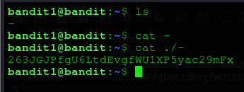

# Bandit Level 1
## Level Goal
The password for the next level is stored in a file called - located in the home directory.
## Solve
First we need to login, using the password retrieved in the previous level.

Now, after login, we need to move towards the goal.
There we see something peculiar, that was the `-` file. We cannot retrieve the content of the `-` file, using the normal `cat -` command, because linux will treat it as `stdin`.
So, to solve this problem we can, simply do : `cat ./-`. Which can be interpreted as : `cat current_directory/-`, which is path to a file named `-`.
So now , it will not treat `-` as stdin, because its now a path.

.

We now have a password, which will be helpful, for the next level.

