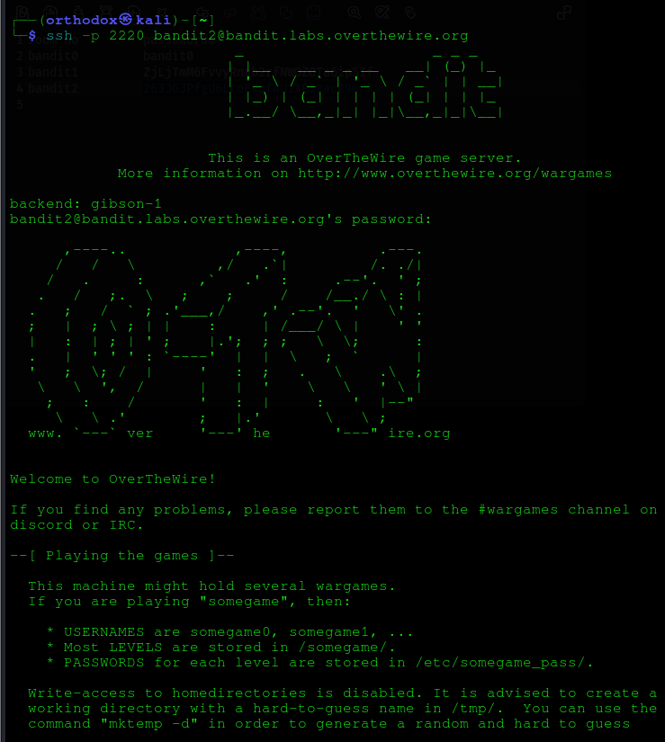
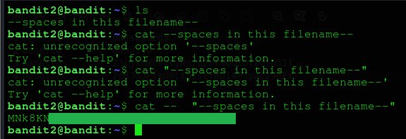

# Bandit Level 2
## Goal 
The password for the next level is stored in a file called --spaces in this filename-- located in the home directory
## Solve 
After login, using the password retrieved from the previous level.
We see the contents of this file and 

The contents of this directory has a file named : `--spaces in this filename--`,
by simply using `cat` command followed by the file name will ressult an error. 
So to retrieve a file contents which has spaces and hyphens, we must use `--` and `" "`.
`cat -- "--spaces in this filename--"`
.
