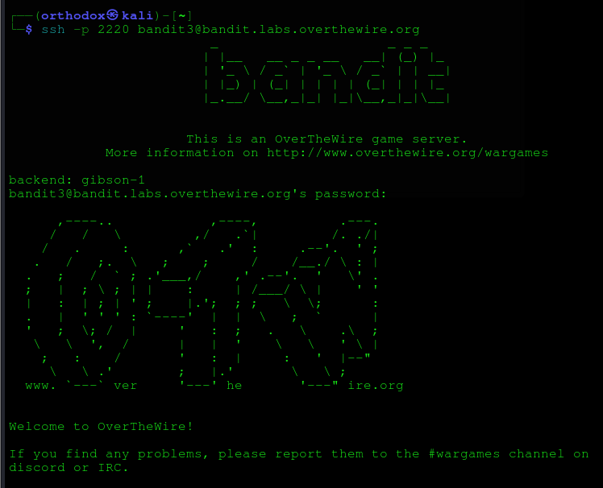
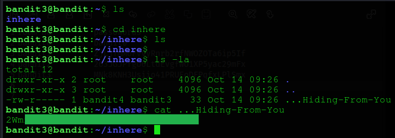

# Bandit Level 3
## Goal 
The password for the next level is stored in a hidden file in the inhere directory.
## Solve
After login, using the credentials retrieved from the previous level.

As stated in the Goal, the password is in a hidden file in the inhere directory. To see the hidden file we can use the command : `ls -la`, as shown below :
.
Hence we retrieved the password and we have completed this level.

