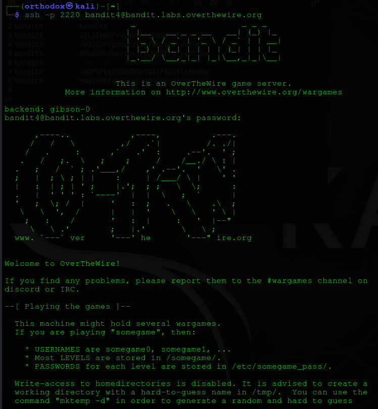
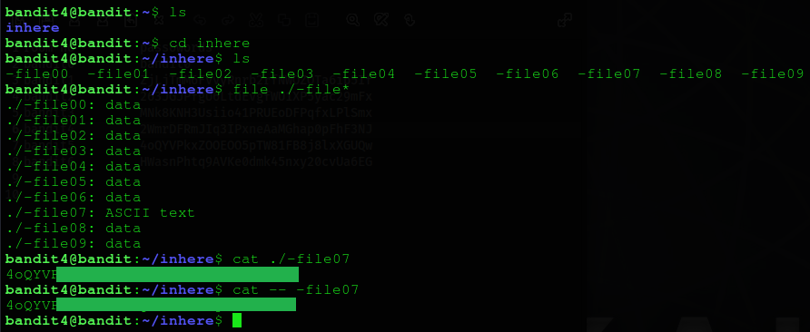

# Bandit Level 04
## Goal 
The password for the next level is stored in the only human-readable file in the inhere directory. 
## Solve
After the successful login, in this level. Using the password, retrieved from the previous level.

We find a directory named : `inhere`, in that directory, there are 9 files. Each contains various types of files.
To know the type of the file, we can use the command `file ./-file*`. This will list all the types of file in the directory, and from there we can simply retrieve password which has the text type file. As shown below :

Hence, we got the password, and have completed the level.
