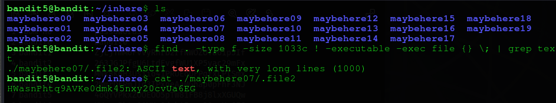

# Bandit Level 05
## Goal 
The password for the next level is stored in a file somewhere under the inhere directory and has all of the following properties:
human-readable
1033 bytes in size
not executable
## Solve
After the successful login, in this level. Using the password, retrieved from the previous level.

Again as previous level, we have the `inhere` directory, inwhich we see multiple directories.
To get the password , we need to filter out according to the listed properties:
human-readable
1033 bytes in size
not executable.
To do that we can use the command : `find . -type f -size 1033c ! -executable -exec file {} \; | grep text`
Part	                         Meaning
find .	                    search from current directory recursively
-type f	                    only files
-size 1033c	                file size exactly 1033 bytes (c = bytes)
! -executable	              exclude executable files
-exec file {} \;	          check file type
grep text	                  filter human-readable files
Using this filter, we can find the password, as shown below :

